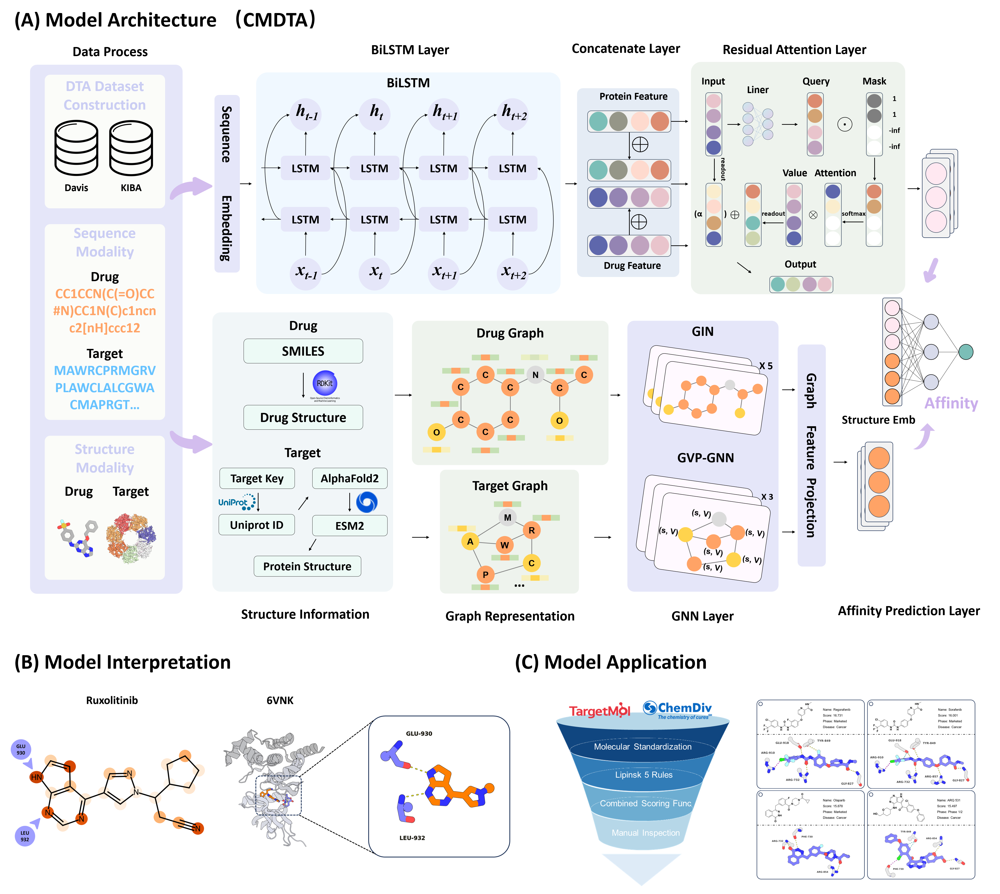

# CMDTA: an advanced cross-modal deep learning framework for enhanced prediction of drug-target affinity
CMDTA is a novel deep learning framework for accurately predicting drug-target affinity (DTA). By uniquely leveraging both 1D sequence and 3D structural information through a parallel dual-path architecture, CMDTA provides a more comprehensive and precise model of molecular interactions.

## Framework


## Installation
First, you need to clone our code to your operating system.

```
git clone https://github.com/slouoo/CMDTA.git
cd CMDTA
```


## The environment of PocketDTA
Before running the code, you need to configure the environment, which mainly consists of the commonly used torch==1.13.0+cu117, rdkit==2023.3.2, torch-geometric==2.3.1 and other basic packages.
```
python==3.7.16
torch==1.13.0+cu117
torch-geometric==2.3.1
scipy==1.7.3
rdkit==2023.3.2
pandas==1.3.5
ogb==1.3.5
networkx==2.6.3
mol2vec==0.2.2
fair-esm==2.0.0
h5py==3.8.0
dgl==1.1.3
```
Of course you can also directly use the following to create a new environment:
```
conda create -n PocketDTA python==3.7
conda activate PocketDTA
pip install requirements.txt
```
