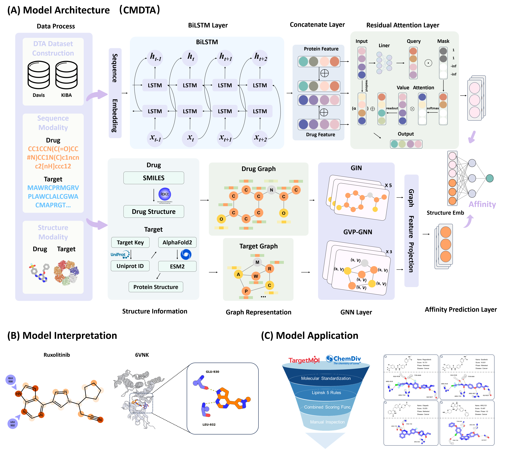

# CMDTA: an advanced cross-modal deep learning framework for enhanced prediction of drug-target affinity
CMDTA is a novel deep learning framework for accurately predicting drug-target affinity (DTA). By uniquely leveraging both 1D sequence and 3D structural information through a parallel dual-path architecture, CMDTA provides a more comprehensive and precise model of drug-target interactions.

## Framework


## Installation
```
git clone https://github.com/slouoo/CMDTA.git
cd CMDTA
```


## Requirements of CMDTA
```
python==3.8.20
torch==2.4.1+cu124
torch-geometric==2.6.1
torch-cluster==1.6.3
torch-scatter==2.1.2
torch-sparse==0.6.18
scikit-learn==1.3.2
scipy==1.10.1
rdkit==2022.9.5
pandas==2.0.3
networkx==3.1
atom3d==0.2.6
```
## Dataset
The two benchmark datasets Davis and KIBA and the target 3D structure are available in [Google Cloud Drive](https://drive.google.com/file/d/1osd9GRS1itQUi8e3NzBlZdnndllfIGxV/view?usp=sharing).
